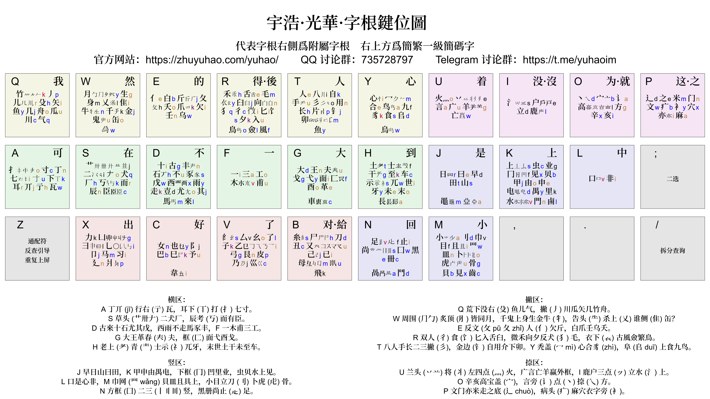

<!-- omit in toc -->
# 十分钟入门宇浩输入法
{: .no_toc }

  

    目录
  

  {: .text-delta }
1. TOC
{:toc}

{: .highlight }
这里，我会对宇浩输入法的基本规则进行简单介绍。如果你从未接触过字形输入法，可以从头开始一步一步学习。[点击此处阅读详细的《宇浩输入法详细教程》。](./learn)

## 汉字拼图

汉字，区别于其他字母文字，有着高度的统一性。不管你使用哪一种方言，不管你会不会普通话，不管你知不知道这个字的读音，只要你把它写在纸上，就能同其他人进行交流（笔谈）。这是字形输入法的一大优势：不借助语音，只关注字的形态。你只要会写，就能将这个字输入到电脑中。宇浩输入法作为一款**字形输入法**，其设计的理念就是希望如同在纸上书写一般去打字，并适合各种文本的创作。当你脑海中想到的对话是方言时，你用拼音输入可能会卡壳、会错误，但用宇浩输入法就不会有问题。

那么，宇浩输入法是怎样做到打字如写字的呢？

我们都知道，每一个汉字，都是由**笔画**或**部首**组成的。将这些部首和笔画拼在一起，就组成了一个个汉字。

- 李 = 木子
- 鸽 = 合鸟
- 琴 = 王王人丶乛
- 樂 = 白幺幺木
- 辭 = 爪マ冂厶又辛
- 愛 = 爪冖心夂
- 爱 = 爪冖𠂇又

宇浩输入法的本质，就是拼字。这些构成汉字的基本部首或笔画，称为**字根**。

我们给每一个字根以两个编码，由A到Y的25个字母构成，分别叫「大码」和「小码」。当我们把字根对应的「大码」；输入到电脑中（偶尔需要输入「小码」），汉字就被组合起来了，并直接显示在屏幕上。

## 字根编码

宇浩输入法的每一个字根（部首、笔画）都有大码和小码，是由两个拉丁字母构成的，比如「讠」字旁就是大码`O`小码`a`。其中，「大码」比较重要。「小码」的重要性稍微低一些。

字根的「大码」，是按照该字根**第一笔的笔画**，在键盘上分区分布。

- ASDFGH 包含了首笔为「横」的字根，例如：`A寸` `F一`等。横区在键盘中排左侧。
- JKLNM 包含了首笔为「竖」的字根，例如：`J日` `K上`等。竖区在键盘中下排右侧。
- QWERTY 包含了首笔为「撇」的字根，例如：`P竹` `T人`等。撇区在键盘上排左侧。
- UIOP 包含了首笔为「捺」和「点」的字根，例如：`U言` `I立`等。捺区在键盘上排右侧。
- BVCX 包含了首笔为「折」的字根，例如：`B刀` `C巴`等。折区在键盘下排左侧。
- Z 键没有字根，可以用来反查拼音或作其他用途。

字根的「小码」，选自它汉语拼音中的一个字母。如果拼音中有`z`或`x`，那么就选取`k`来代替。

在汉字体系中，最常用的100个字根（部首、笔画），占了85%的使用频率！也就是说，当你知道这100个字根的大码小码（主要是大码）以后，你就可以组合出85%的汉字来。按照频率降序，这些字根是：

{: .highlight }
口一月丶日人亻扌白土丷二又丿宀木尚辶小冖厶心氵八女大艹𠂇匕寸也乙戈目讠不龰阝竹了十夂王刂儿力凵冂子斤火米丁彐纟文立士夕乂门卜自尤彳羊止禾贝尸工乚上囗至手𬺰艮车石田己几牛见走甲且彡犬巾西方刀殳七弓巴矢示

{: .important }
在接下来的学习中，请**务必**按照上面的次序记忆字根，而不是一股脑地背诵全部。先练熟*边际收益*高的字根，会显著加快上手打字的进程，增加学习乐趣和成就感。而偏僻的字根，可以等未来边用边熟悉。

[使用字根练习页面来练习最常用的100个字根](../../practice/practice_100.html)。

字根分布图和字根口诀如下：

## 单字编码

一个汉字，可能由很多很多字根组成，但宇浩输入法最多只需要四个字根就够了，也就是第一、第二、第三、最末，这四个字根。想要打出一个汉字，只需要按照以下的规则：

1. 依次取一、二、三、末根大码。
2. 不足四码时，补上末根小码。
3. 仍然不足四码时，补上首根小码。

或者用一句话概括：

ABCZza 取前四码

{: .example }
>一例，「整」字，分为五个字根：
>
>- 木，大码 `F` 小码 `v`
>- 口，大码 `L` 小码 `v`
>- 攵（反文），大码 `E` 小码 `h`
>- 一，大码 `F` 小码 `i`
>- 止，大码 `N` 小码 `i`
>
>我们在输入时，只需要取一、二、三、末根，也就是「木口攵止」即可。依次输入四个字根的大码 `FLEN`，就能够打出「整」字。

{: .example }
> 一例，「的」字，分为三个字根：
>
>- 白，大码 `E` 小码 `b`
>- 勹，大码 `W` 小码 `y`
>- 丶，大码 `O` 小码 `d`
>
>我们在输入时，依次输入三个字根的大码 `EWO`，观察到不足四码，我们补上最后一根的小码 `d`。因此输入 `EWOd` 就能够打出「的」字。

{: .example }
>一例，「好」字，分为两个字根：
>
>- 女，大码 `C` 小码 `n`
>- 子，大码 `V` 小码 `k`
>
>我们在输入时，依次输入两个字根的大码 `NV`，观察到不足四码，我们补上最后一根的小码 `k`。观察到仍然不足四码，我们补上首根的小码 `n`。因此输入 `CVkn` 就能够打出「好」字。

{: .example }
>其他例字：
>
>- 李 = 木子 > 木子 > Iv Vk > IVkv
>- 鸽 = 合鸟 > 合鸟 > Ye Ya > YYae
>- 琴 = 王王人丶乛 > 王王人乛 > Gn Gn Te Vi > GGTV
>- 樂 = 白幺幺木 > 白幺幺木 > Eb Vo Vo Fv > EVVF
>- 辭 = 爪マ冂厶又辛 > 爪マ冂辛 > Ek Bu Kf Ox > EBKO
>- 愛 = 爪冖心夂 > 爪冖心夂 > Ek Ym Yi Eh > EYYE
>- 爱 = 爪冖𠂇又 > 爪冖𠂇又 > Ek Ym So Bu > EYSB

为了输入快捷，某些常用字我们只要打它的第一个字母，加一个空格就可以了，我们叫这些常用字为一级简码字。从A到Y排列，一级简码字分别是：

{: .highlight }
可对好不的一大到没是上中小回为这我得在人着了然出心

宇浩的字根设计，使得最高频的汉字分布在最容易按的键上。

{: .example }
比如：「的」在`E`上，「一」在`F`上，「了」在`V`上，「没」在`I`上，「不」在`D`上，「上」在`K`上。

二级简码字共625个，是该字全码的前两个字母。宇浩输入法**全简一致**。

除了简码单字外，一、二级简码的二选和三选位上还设置了简码词语，方便用户快速输入。

## 词语输入

宇浩输入法**字词编码一致**。规则如下：

- 两字词，取每个字**全码**的前两码即可。
- 三字词，取前两字的第一码，和第三个字的前两码即可。
- 四字词及以上，取前三字的第一码，和最后一个字的第一码即可。

宇浩词库对词语和排序进行了优化，并分为若干词库文件，借此保障用户的自主选择权。分词库包括：

- 宇浩核心词库：约50000个词语。推荐只使用该词库配合单字输入，以获得最佳体验。
- 宇浩增广词库：约30000个词语，频率较低，除非有特殊需求，否则不建议开启。
- 宇浩成语诗词词库：约15000个成语和诗词，除非有特殊需求，否则不建议开启。

所有词库都分为简体和繁体。其中，繁体词库包含以下字形标准：

- 大陆古籍印刷通用规范
- 台湾标准
- 香港标准
- OpenCC 标准

## 字根表

| 分区 | 键位 |                                                                                                                    字根 |
| :--- | :--- | ----------------------------------------------------------------------------------------------------------------------: |
| 横   | A    |                                                寸 c  亍 h  七 i  丌 j  下(丅) k  丁 n  扌(キヰ) o  耳 r  {于下} u  瓦 w |
|      | S    |                                               臣 c  厂 h  二(⺀) i  艹(卅龷卌{冓上}) j  丂 k  辰 n  {左上} o  犬 q  而 r |
|      | D    |            歹 d  古 g  石(丆) h  十 i  其 j  走 k  來 l  馬({馬上}) m  丰 n  尤(尢) o  豕 s  不 u  戊 w  西(襾) x  雨 y |
|      | F    |                                                                                      三 a  爾 e  一 i  工 o  甫 u  木 v |
|      | G    |                                         車({專上}叀) c  大 d  革 e  匚({畏下}) f  戈 g  面 i  王 n  酉 o  夫(𡗗) u  弋 y |
|      | H    |                              長(髟镸) a  车 c  未 e  士({穀頭}龶) f  干 g  世 i  至 k  末 o  示 s  土(耂) t  兀 w  牙 y |
| 竖   | J    |                                                            {亞下}({亞中}) a  早 d  曰 e  黽({龜下}) m  日 r  山 s  田 t |
|      | K    |              贝 b  虫 c  电 d  申 e  冂({雋下}{冂丶}) f  业 g  甲 j  鹵 l  門 n  由 o  攴 p  上(丄) s  水 v  见 x  禺 y |
|      | L    |                                                                                                              非 i  口 v |
|      | M    |                      小 a  貝 b  齒 c  刂 d  目 f  骨 g  且 i  皿 n  卜({龍右}{乍下}) o  虎({虎头}) u  巾 v  罒 w  見 x |
|      | N    |                                                      咼(冎) a  冊 c  鬥 d  黑 e  龰 f  止 i  尚(龸〢〣丨) s  足 v  囗 w |
| 撇   | Q    |                                   川 c  殳 h  矢 i  几 j  竹({⺮右}) k  凡 n  舟 o  丿 p  气 q  儿({荒下}) r  瓜 u  鱼 y |
|      | W    |                           生 g  隹 i  金 j  千 k  乂(𠂭) l  身 m  牛(⺧) n  缶 o  鬼({卑上}) u  {爲下} w  月({祭上}⺆勹) y |
|      | E    |                                                                 白 b  亻 e  夂 h  欠 i  斤(⺁) j  爪 k  壬 n  夭 o  乌 w |
|      | R    | 彳 c  舌 e  風 f  禾 h  {微上} i  匕 i  臼 j  夕 k  僉 l  毛 m  向({囟框}{向框}) n  鳥({鳥上}) o  犭 q  饣 s  入 u  𧘇 y |
|      | T    |    人 e  长 h  八({介下}) i  钅 j  自 k  卯({卯左}{乐上}{齊右}{卬左}) m  用 n  彡({癶右}{两撇}) o  片 p  手(龵) u  魚 y |
|      | Y    |                                                 鸟({鸟上}) a  𠂤 d  合 e  九 f  心(忄) i  豸 k  冖 m  食 s  烏({烏上}) w |
| 捺   | U    |                                                                  言 a  丷(䒑リ丬) e  羊 g  火(灬) o  广 u  亡({贏頭}) w |
|      | I    |                                                                                 氵(⺍) c  立 d  户(戸戶) e  鹿({鹿上}) l |
|      | O    |                                                                        讠 a  宀(亠{齊頭}) b  丶(乀) d  方 g  亥 i  辛 x |
|      | P    |                                                              麻 a  疒 b  辶 d  之 e  亦 i  米 m  门 n  文 w  穴 x  衤 y |
| 折   | B    |                          丑 c  刀 d  尸({眉上}) h  已 i  己 j  飛 k  母({互中}{母框}) m  糸 s  {鼠下} u  又(マコス癶) u |
|      | V    |                                        巛(巜) c  弓 g  乙(㔾) i  乃 j  子 k  了 l  艮 n  幺 o  皮 p  纟({纟上}) s  厶 v |
|      | C    |                                                              巴 b  韋({五下}) i  阝 j  巳 k  女 n  矛 o  予 u  也(乜) y |
|      | X    |                                          凵(丱丩屮) g  乚(〇) i  卩 j  力 k  彐({反彐}肀) l  马 m  廴 n  爿 p  羽(习) u |